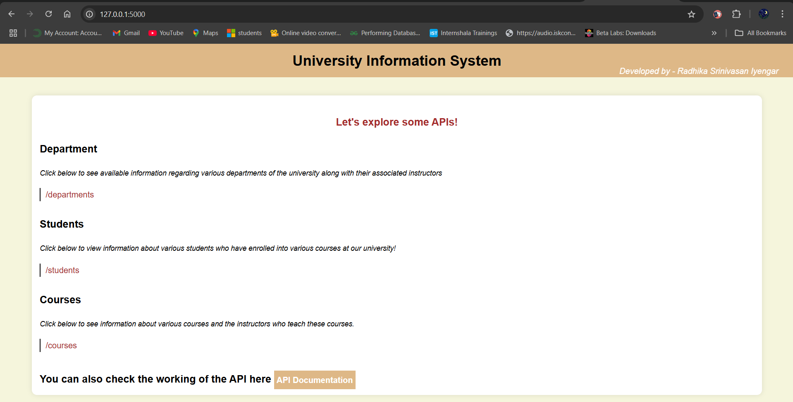
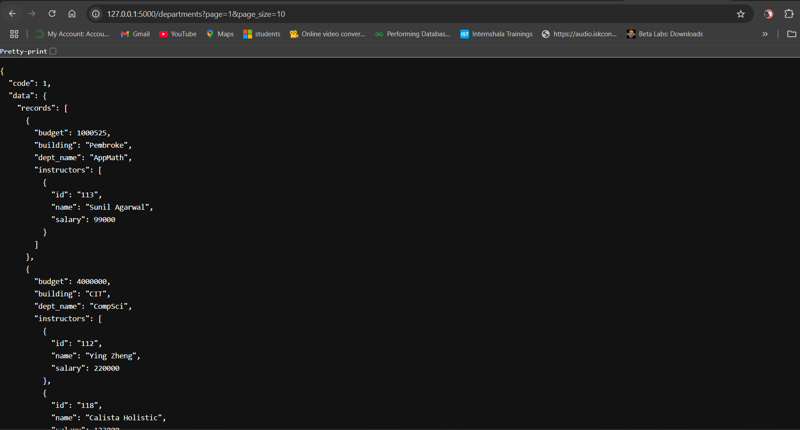
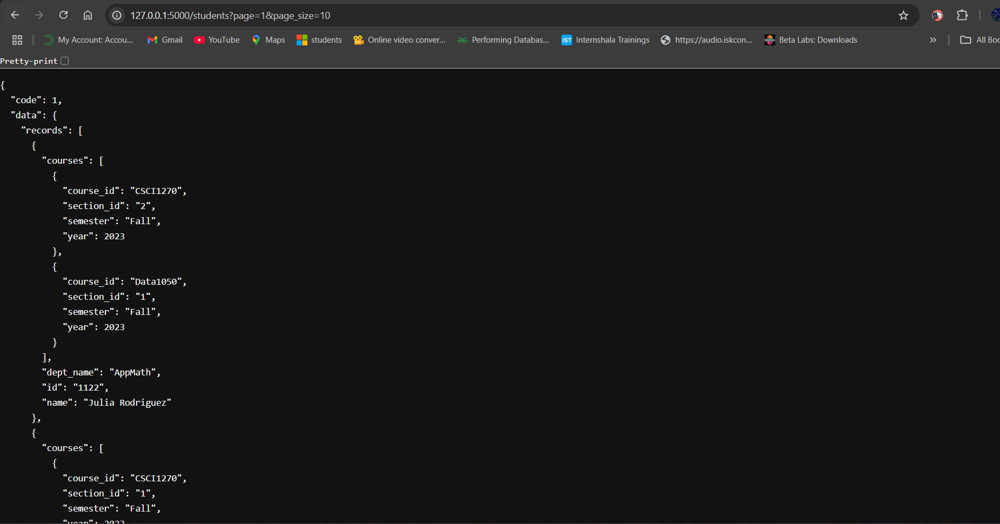
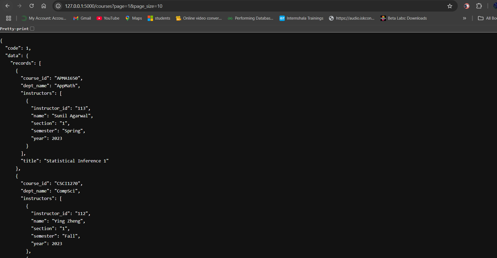
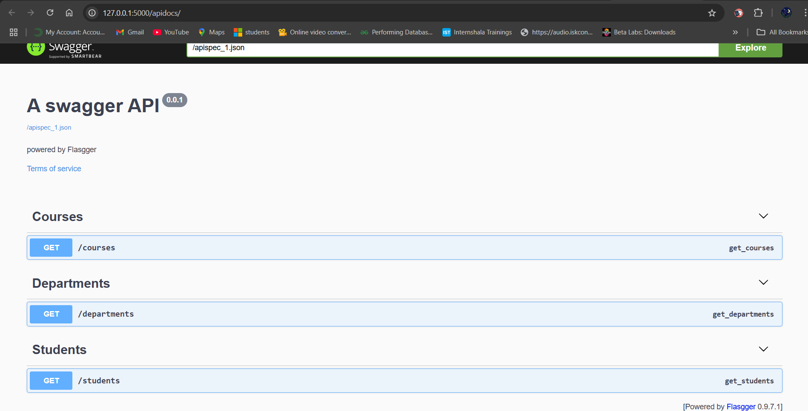

<h1 align = "center">🎓 University Management System APIs<h1>
<h3>This is a Flask-based REST API project for accessing university departments, students, and courses data from a MySQL database.  
It provides easy-to-use endpoints, Swagger API documentation, and a modern web interface for testing.</h3>

---
##🚀 Features
- RESTful API GET endpoints for:
  - **Departments** with instructor details
  - **Students** with course enrollment details
  - **Courses** with instructor teaching details
- **Swagger API Documentation** (`Flasgger` powered)
- **MySQL database** integration
- **Responsive Web Interface** (HTML/CSS)
- Modular code structure using Flask **Blueprints**
- Pagination support for all APIs

---

## 📦 Prerequisites

- Python 3.x
- MySQL database (with university data loaded)
- `pip` package manager

---

## 🛠 Installation

1. **Clone the repository:**
   ```bash
   git clone https://github.com/RadhikaIyengar/University-Information-System.git
   cd <project-directory> 

## How to Run the code?

- Create and activate a virtual environment

- python -m venv venv
- On Windows: venv\Scripts\activate
- Install dependencies:
    - pip install -r requirements.txt
- Configure connection.py file with correct MySQL credentials (host, username, password, database name).


## Project Structure
```bash
.
├── assets                  # includes images for use
├── Database
│   └── connection.py        # Database Connections
├── models
│   ├── courses.py           # Courses Model
│   ├── departments.py       # Departments Model
│   └── students.py          # Students Model
├── routes
│   ├── courses_routes.py    # Courses Routes
│   ├── departments_routes.py # Departments Routes
│   └── students_routes.py   # Students Routes
├── static
│   └── styles.css           # Stylesheet for the Web Interface
├── templates
│   └── home.html            # Homepage (Web Interface)
├── utils
│   └── pagination.py        # Pagination Logic
├── app.py                   # Main Flask App
├── README.md                # Project Documentation
└── requirements.txt         # Python Dependencies

```
## To run the Application

- Start the flask server by typing the following command in the terminal -

- python app.py

- Access the endpoints:

**Web Portal: http://127.0.0.1:5000**

**Swagger API Documentation: http://127.0.0.1:5000/apidocs/**

🔥 Web Interface
The web interface provides quick links to:

- Departments API

- Students API

- Courses API

- Embedded Swagger API documentation

## API Endpoints

All APIs support pagination via:

**page(default = 1)**

**page_size(default = 10)**

**Common JSON response structure**
```bash
{
  "code": 1,
  "msg": "Success",
  "data": {
    "records": [],
    "total": 0
  }
}
```
🧬 Departments
Endpoint: /departments

Returns: List of departments and associated instructors.

🧑‍🏫 Students
Endpoint: /students

Returns: List of students and enrolled courses.

📚 Courses
Endpoint: /courses

Returns: List of courses and teaching instructors.

⚙️ Dependencies
Flask - Web framework
Flasgger - Swagger API Documentation

## 📸 Screenshots

1. Main Webpage


---
2. Department API


---
3. Student API


---
3. Course API


---
4. Swagger API Documentation


## 📦 Extra Functionalities Implemented:Data Storage and Retrieval Using Redis & MongoDB
🔍 Objective
Extend the API project by integrating two storage systems — Redis and MongoDB — for caching and persistent data storage.

## ✅ Features Implemented
# Data Retrieval from APIs

- Fetches paginated data from Department, Student, and Course APIs.

# Redis Integration

Stores data as key-value pairs:

- departments:{dept_name}

- students:{name}

- courses:{title}

- Includes Redis error handling and duplicate key prevention.

## MongoDB Integration

Stores data in three collections:

- departments

- students

- courses

Duplicate entries avoided using filters before insert.

## Error Handling

- Full exception handling for:

- Redis and MongoDB connection issues

- API timeouts and invalid JSON

- Key and document retrieval failures

## 📁 Key Files

``` bash

| File                     | Description                                          |
| ------------------------ | ---------------------------------------------------- |
| `store_data.py`          | Fetches from APIs, inserts into Redis & MongoDB      |
| `retrieve_from_redis.py` | Retrieves and prints specific records from Redis     |
| `retrieve_from_mongo.py` | Retrieves and prints filtered documents from MongoDB |
| `redis_connection.py`    | Handles Redis connection with error handling         |
| `mongo_connection.py`    | Handles MongoDB connection with error handling       |

```

## 📸 Screenshots for the Redis and MongoDB Functionalities

1. Storing Data in Redis


---

2. Storing Data in MongoDB


